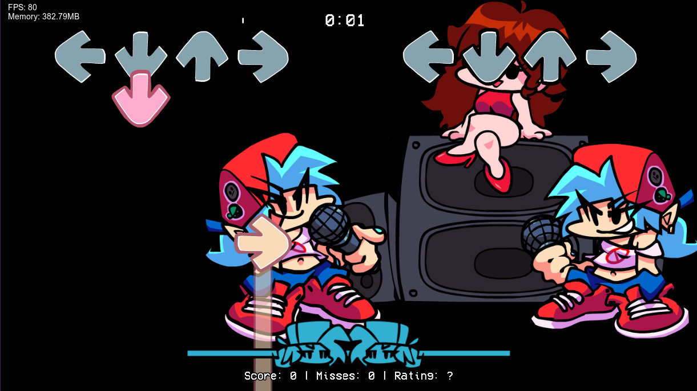
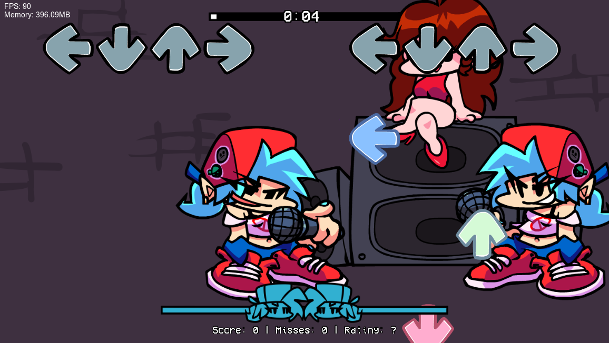
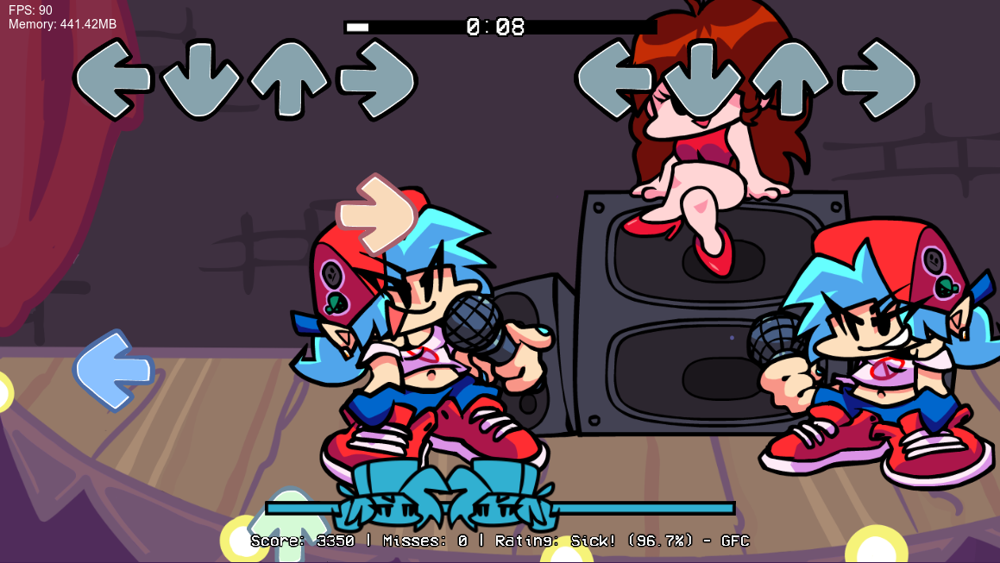

# Creating a Custom Stage
Begin by going into your mod folder and adding a folder named **stages**. This is where your stage scripts and data will be located!<br>

## Stage JSON
> [!IMPORTANT]
> There's an upcoming Stage Editor in the **1.0 update** for Psych Engine! As such, this section should only really apply in 0.7.3 and lower versions.

Create a new JSON file, in your new stages folder, with the name of your new stage (for example, `myStage.json`).
Here's an example JSON for a stage:
```json
{
	"directory": "",
	"defaultZoom": 0.9,
	"camera_speed": 1,
	"stageUI": "",
	
	"boyfriend": [770, 100],
	"opponent": [100, 100],
	"girlfriend": [400, 130],
	"hide_girlfriend": false,

	"camera_boyfriend": [0, 0],
	"camera_opponent": [0, 0],
	"camera_girlfriend": [0, 0]
}
```

> [!NOTE]
> For the purposes of softcoded mods, `directory` is entirely useless.

Let's see what this all means:

### defaultZoom
**Decimal value.** This is the default camera zoom on the stage! A value of 1 is equal to 100% zoom.

### camera_speed
**Decimal value.** Changes the speed of the camera as it focuses on each character! A value of 1 is equal to 1x speed.

### stageUI
**String value.** This value changes the folder the UI uses to pull assets from. By default, `"pixel"` is available to change your stage to use pixel assets.<br>
The folder the UI will pull assets from should be named after the value you put in stageUI, with UI after it.

> [!IMPORTANT]
> If you're using the `"pixel"` stageUI, the image assets must also have the suffix "-pixel" (ex. "sick" -> "sick-pixel")

**EXAMPLE:**
- `"stageUI": "test"` means the UI assets will be pulled from a folder named `testUI` in your images folder.

### boyfriend
**2 entry array.** This indicates the position of the Boyfriend (player) character within the stage.<br>
The first entry in the array is for the X position, and the second entry is for the Y position.

**EXAMPLE:**
- `"boyfriend": [100, 50]` puts the Boyfriend character in the positions x: 100 and y: 50.

### opponent
**2 entry array.** Same as [`boyfriend`](#boyfriend), but with the Dad (opponent) character.

### girlfriend
**2 entry array.** Same as [`boyfriend`](#boyfriend), but with the Girlfriend (speaker) character.

### hide_girlfriend
> [!IMPORTANT]
> `hide_girlfriend` not only hides Girlfriend, but completely removes her from the stage.

Boolean (true/false) value. If set to true, the Girlfriend character will be **hidden**.

**EXAMPLES:**
- `"hide_girlfriend": true` hides Girlfriend.
- `"hide_girlfriend": false` doesn't hide Girlfriend.

### camera_boyfriend
**2 entry array.** Same as [`boyfriend`](#boyfriend), but instead indicates the camera offset for the Boyfriend character.

### camera_opponent
**2 entry array.** Same as [`camera_boyfriend`](#camera_boyfriend), but with the Dad (opponent) character.

### camera_girlfriend
**2 entry array.** Same as [`camera_boyfriend`](#camera_boyfriend), but with the Girlfriend (speaker) character.

## Stage Script
> [!IMPORTANT]
> There's an upcoming Stage Editor in the **1.0 update** for Psych Engine! As such, this section should only really apply in 0.7.3 and lower versions. Scripts, however, also have other useful applications.

> [!NOTE]
> The examples used here focus on **Lua** scripts, but [HScript](../hscript/introduction.md) can also be used to make stages!

If you've done everything correctly and tested your new stage, you may have noticed something:



It's completely empty!<br>
No worries; this is just because we haven't added the assets themselves. This is what stage scripts are for!<br>
The following stage script example will be a simple recreation of the **Week 1 stage**. I've dropped the stage's assets from `assets/week1/images/` to `myMod/images/stage/` in this example.

Begin by creating an empty LUA file, with the same name as your stage JSON (for example, `myStage.lua`).<br>
Now, add the `onCreatePost` [callback]() to your script! This is the callback that runs when the game is fully initialized, so we can add the sprites. It should look something like this:
```lua
function onCreatePost()
	-- this is where we create the stage assets!
end
```

Now lets add a sprite to the game; we can do this with the `makeLuaSprite` and `addLuaSprite` functions.
```lua
function onCreatePost()
	makeLuaSprite('stageback', 'stage/stageback', -600, -200)
	setScrollFactor('stageback', 0.9, 0.9)
	addLuaSprite('stageback', false)
end
```
Let's quickly explain what this all does:

### makeLuaSprite
As it name describes, makes the sprite.
- The **first** argument is a tag; it's basically a nickname so we can access our sprite later! This can have anything, as long as its a [string]().
- The **second** argument is the path to our sprite. This is relative to the "images" folder in your mod, and excludes the filetype (which should be always PNG).<br>
  For example, since our image is within `images/stage/stageback.png`, we put `"stage/stageback"` here.
- The **third** argument is the **X position** of our sprite within the world.
- Similarly, the **fourth** argument is the **Y position** of our sprite.

### setScrollFactor
This changes the "scroll factor" of your new sprite! This is used to make a parallax effect, where sprites further away appear to move less.
- The **first** argument is the tag of the sprite, which we set earlier on makeLuaSprite.
- The **second** argument is the scroll factor in the **X axis**. A value of 1 means 1x (as in it completely scrolls with the camera)
- Similarly, the **second** argument is the scroll factor in the **Y axis**.
For example, setting the X and Y scroll factor to 0 makes the sprite appear to be completely static, as the camera moves.

### addLuaSprite
This simply adds the sprite to the game, so it can show up!
- The **first** argument is the tag of the sprite, which we set earlier on makeLuaSprite.
- The **second** argument dictates if the sprite should be *in front* (`true`) or *behind* (`false`) of the characters. This argument defaults to `false`, and as such can be omitted if not necessary.

We have now created our first stage sprite! If you restart the song, you'll be able to see the changes we've done so far. It should look something like this:



Let's finish creating the rest of the stage:
```lua
function onCreatePost()
	makeLuaSprite('stageback', 'stage/stageback', -600, -200)
	setScrollFactor('stageback', 0.9, 0.9)
	addLuaSprite('stageback', false)
	makeLuaSprite('stagefront', 'stage/stagefront', -650, 600)
	setScrollFactor('stagefront', 0.9, 0.9)
	addLuaSprite('stagefront', false)
	makeLuaSprite('stagelight', 'stage/stage_light', 1225, -100)
	setScrollFactor('stagelight', 0.9, 0.9)
	addLuaSprite('stagelight', false)
	makeLuaSprite('stagecurtains', 'stage/stagecurtains', -500, -300)
	setScrollFactor('stagecurtains', 1.3, 1.3)
	addLuaSprite('stagecurtains', true)
end
```
As you can see, we've applied the same functions, just using different values! Now our stage looks like this:



Now we have a fully functional stage! If you want to learn more and do more advanced things, refer to the [Lua Script API](../lua/psych-api/index.md)!
